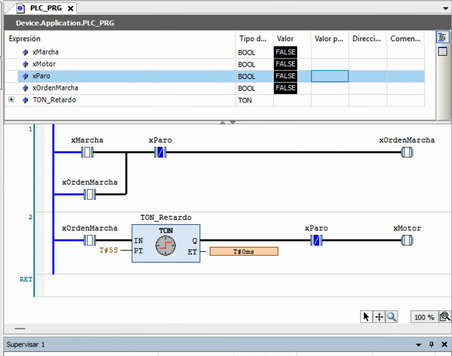

# 04 — Marcha-paro con retardo a la conexión (TON)



El motor arranca con retardo tras la orden de marcha, mediante un temporizador **TON** (on-delay). Como la marcha es momentánea y el retardo dura más que el pulsado, la orden se memoriza en un bit auxiliar local (`xOrdenMarcha`) con enclavamiento; ese bit alimenta el `IN` del TON, y su salida `Q` arranca el motor al cumplirse `PT`.

## Entradas / Salidas

| Señal | Nombre | Tipo | Descripción |
|---|---|---|---|
| Entrada | `xMarcha` | BOOL | Pulsador de marcha (NA) |
| Entrada | `xParo` | BOOL | Pulsador de paro (NA) |
| Interna | `xOrdenMarcha` | BOOL | Orden de marcha enclavada (memoria local) |
| Interna | `TON_Retardo` | TON | Temporizador on-delay (PT = T#5S) |
| Salida | `xMotor` | BOOL | Contactor del motor |

## Lógica (Ladder)

```
Net1:  (xMarcha OR xOrdenMarcha) AND (NOT xParo) → xOrdenMarcha
Net2:  xOrdenMarcha → [ TON  IN, PT=T#5S → Q ] → xMotor
```

La orden se mantiene durante toda la marcha (sostiene `IN`=1); solo el paro la cancela. Un TON solo cuenta si `IN` permanece a 1 de forma continua: cualquier corte reinicia `ET` a 0.

## Probar en simulación

Forzar `xMarcha` a TRUE y soltar: el motor arranca a los 5 s. Forzar `xParo` antes de cumplirse el tiempo: la cuenta se reinicia y el motor no llega a arrancar.
